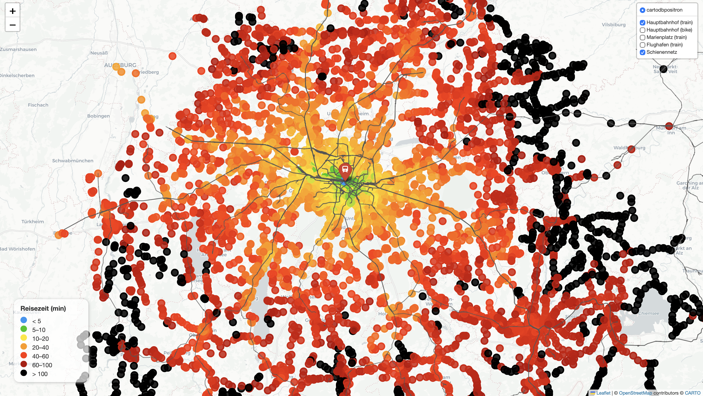

# Munich Transit Travel Times

This is a lightweight, slice of my project that maps public-transit travel times to two Munich landmarks: Hauptbahnhof and the Airport. Provide your own API key via `.env` to fetch routes and render the interactive map.

## What is inside
- `fetch_hbf.py`: Fetches fastest transit routes to Munich Hauptbahnhof for many origins.
- `fetch_airport.py`: Fetches fastest transit routes to Munich Airport for many origins.
- `map_hbf_airport.py`: Builds an interactive Folium map from the saved JSON results.
- `.env.example`: Template for providing your own Google Maps API key.
- `example.png`: Preview of the generated map output.

## Prerequisites
- Python 3.9+
- Google Maps Directions API key (transit enabled)
- Input coordinates Excel file `cords.xlsx` (two columns: latitude, longitude). Not included here.
- Optional: OSM railway shapefile (`gis_osm_railways_free_1.shp` and sidecar files) for the rail overlay on the map.

Install Python dependencies (adjust to your environment):

```bash
pip install -r requirements.txt
```

Note: `geopandas` may require system libs like GEOS/PROJ/GDAL depending on your platform.

## Setup
1) Create a copy of `.env.example` as `.env` and fill in `GOOGLE_MAPS_API_KEY`.
2) Place `cords.xlsx` in the same folder as the scripts (first column latitude, second column longitude).
3) Optionally place the OSM railway shapefile files next to the scripts if you want the rail overlay.

## How to run
- Quick flow: run both fetchers first, then build the map.
- Steps:
	1) `python fetch_hbf.py`
	2) `python fetch_airport.py`
	3) `python map_hbf_airport.py` (creates `munich_hbf_airport.html`)

- Fetch routes for Hauptbahnhof:

```bash
python fetch_hbf.py
```

- Fetch routes for Airport:

```bash
python fetch_airport.py
```

Each script writes a JSON file (e.g., `directions_results_hbf.json`, `directions_results_airport.json`).

- Build the interactive map (uses the generated JSON files):

```bash
python map_hbf_airport.py
```

The map is saved as `munich_hbf_airport.html`.

## Preview


## Notes on data and privacy
- Station coordinates come from the MVV open data feed: https://www.mvv-muenchen.de/fahrplanauskunft/fuer-entwickler/opendata/index.html
- API keys are never stored in this repo; provide your own via `.env`.
- Google Directions API calls for all MVV stations can add up (hundreds of USD if you query everything at once); limit origins, widen departure intervals, or test on small subsets to control cost.
- Only Munich Hauptbahnhof and Munich Airport are included; add your own destinations and scripts if you need more coverage.
- If you need to reduce API usage, lower `MAX_WORKERS` or increase request spacing in the query scripts.
- Departure times are hard-coded in the scripts: Hauptbahnhof queries run every 5 minutes between 08:00 and 09:00 on 25 Aug 2025; Airport queries run at 08:00 on 25 Aug 2025. Adjust these times to match the service you want (weekday vs weekend schedules differ).
